### Atualizar o sistema operacional Ubuntu 26.04
```bash
sudo apt update && sudo apt install -y
```
### Instalar o PHP e as extensões necessárias e o banco MySQL
```bash
sudo apt install mysql-server php-{fpm,cli,ldap,xmlrpc,soap,curl,snmp,zip,apcu,gd,mbstring,mysql,xml,bz2,intl,bcmath} -y
```
### Preparar o ambiente para o NGINX ( https://nginx.org/en/linux_packages.html#Ubuntu )
```bash
sudo apt install curl gnupg2 ca-certificates lsb-release ubuntu-keyring -y
```

### Criar o diretório .gnupg
```bash
mkdir -p ~/.gnupg
chmod 700 ~/.gnupg
```

### Verficar as chaves 
```bash
curl https://nginx.org/keys/nginx_signing.key | gpg --dearmor \
    | sudo tee /usr/share/keyrings/nginx-archive-keyring.gpg >/dev/null
```
```bash
gpg --dry-run --quiet --no-keyring --import --import-options import-show /usr/share/keyrings/nginx-archive-keyring.gpg
```
### Atualizar os pacotes e instalar o NGINX
```bash
sudo apt update -y && sudo apt install nginx -y
```

### Baixando e instalando o GLPI ( https://github.com/glpi-project/glpi/releases )
```bash
wget https://github.com/glpi-project/glpi/releases/download/11.0.7/glpi-11.0.7.tgz
```

### Descompactando o arquivo glpi-11.0.7.tgz e movendo para a pasta do NGINX
```bash
sudo tar -zxvf glpi-11.0.7.tgz -C /var/www/html/
```
### Configurando permissões da pasta 
```bash
sudo chown www-data:www-data /var/www/html/glpi/ -Rf
```

### Criar o arquivo de configuração do GLPI no NGINX
```bash
sudo vim /etc/nginx/sites-available/glpi.conf
```

### Copie e cole o conteúdo abaixo no arquivo criado acima
```bash
server {
    listen 80;
    listen [::]:80;

    server_name glpi.connect.local;

    root /var/www/html/glpi/public;

    location / {
        try_files $uri /index.php$is_args$args;
    }

    location ~ ^/index\.php$ {
        # the following line needs to be adapted, as it changes depending on OS distributions and PHP versions
        fastcgi_pass unix:/run/php/php-fpm.sock;

        fastcgi_split_path_info ^(.+\.php)(/.*)$;
        include fastcgi_params;

        fastcgi_param SCRIPT_FILENAME $document_root$fastcgi_script_name;
    }
}
```

### Criando link simbólico para o arquivo de configuração do NGINX
```bash
sudo ln -s /etc/nginx/sites-available/glpi.conf /etc/nginx/sites-enabled/
```

### Verificar o NGINX
```bash
sudo nginx -t
```

### Recarregar o NGINX
```bash
 sudo systemctl restart nginx
```

### Criar o banco de dados e o usuário glpi
```bash
sudo mysql -u root -e "create database glpidb character set utf8;"
sudo mysql -u root -e "create user 'glpi'@'localhost' identified by '123@Mudar';"
sudo mysql -u root -e "grant all privileges on glpidb.* to 'glpi'@'localhost' with grant option;"
sudo mysql -u root -e "flush privileges;"
```

### Agora é acessar via browser o GLPI e iniciar o banco de dados .
```bash
http://glpi.connect.local
```


## Figuras do Setup

| Imagem | Descrição |
|--------|-----------|
| [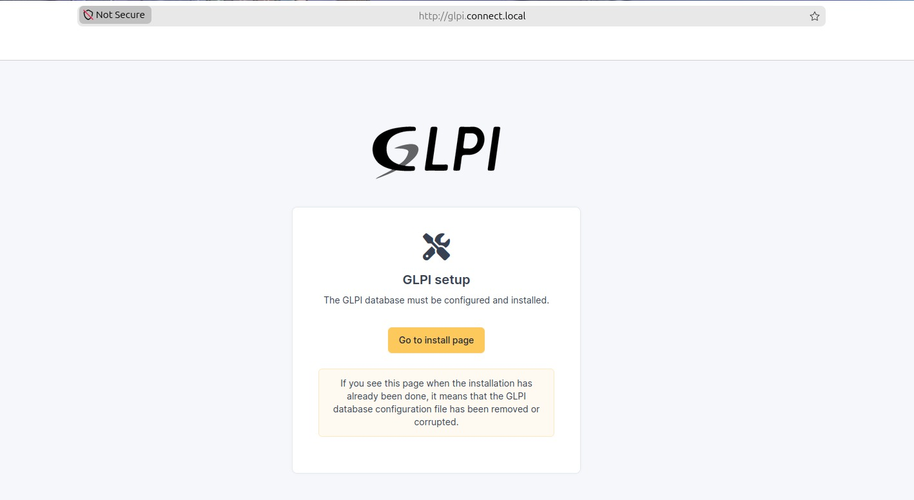](figuras/SETUP-01.jpeg) | Configuração inicial |
| [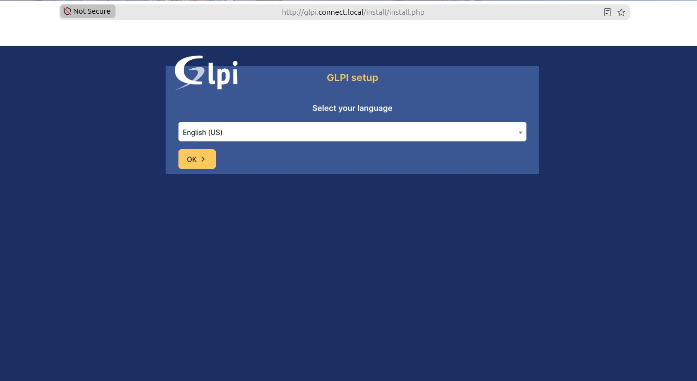](figuras/SETUP-02.jpeg) | Escolha da linguagem |
| [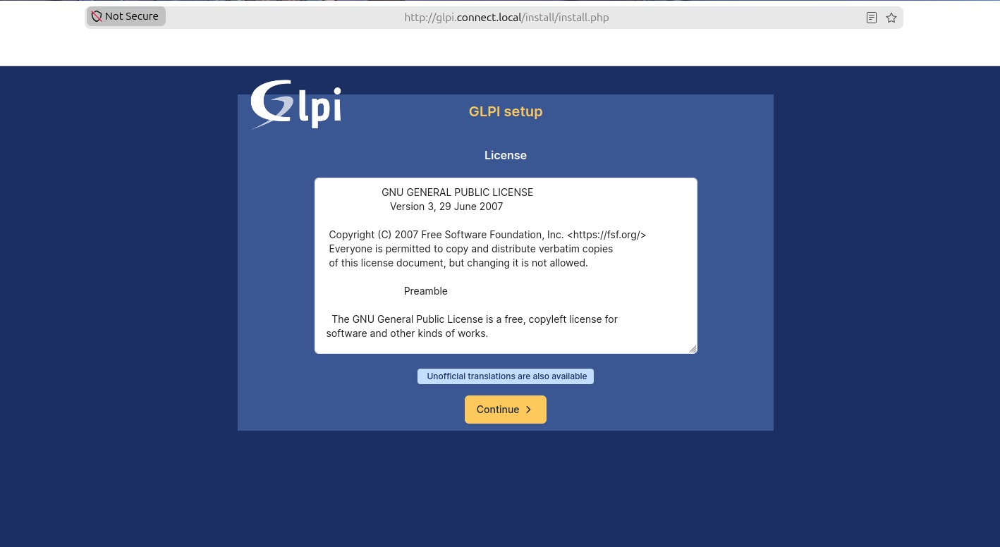](figuras/SETUP-03.jpeg) | Licença |
| [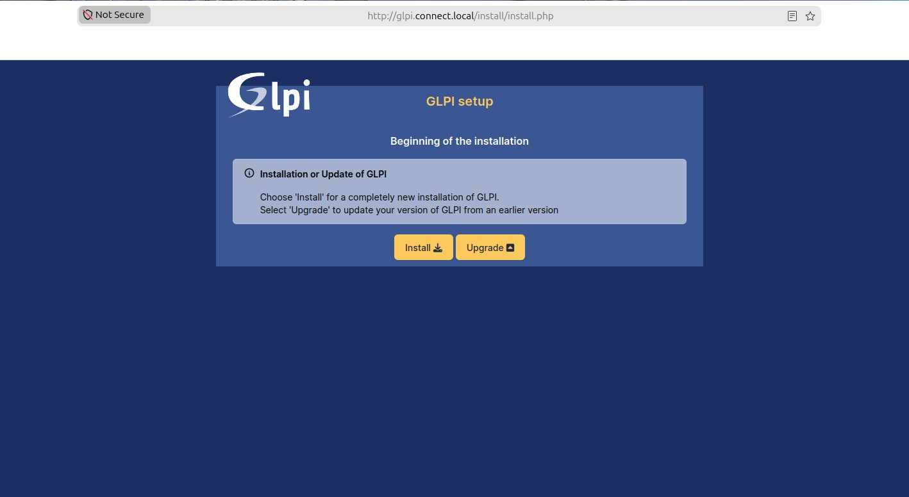](figuras/SETUP-04.jpeg) | Instalação ou Atualizção do GLPI |
| [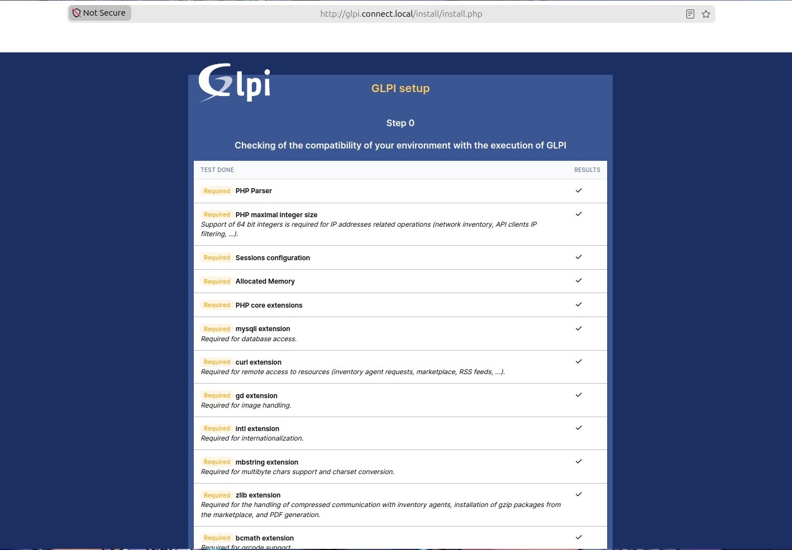](figuras/SETUP-05.jpeg) | Check list do sistema |
| [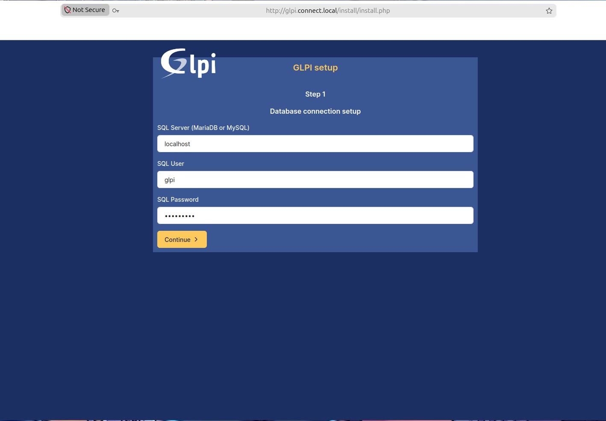](figuras/SETUP-06.jpeg) | Conexão com o banco de dados |
| [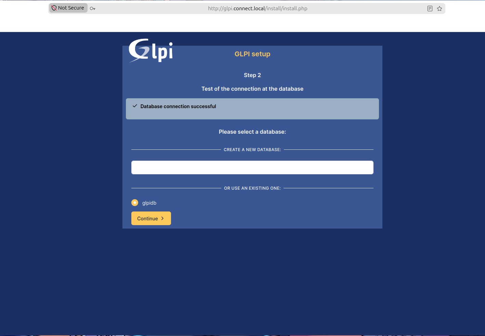](figuras/SETUP-07.jpeg) | Teste de conexão com o banco de dados |
| [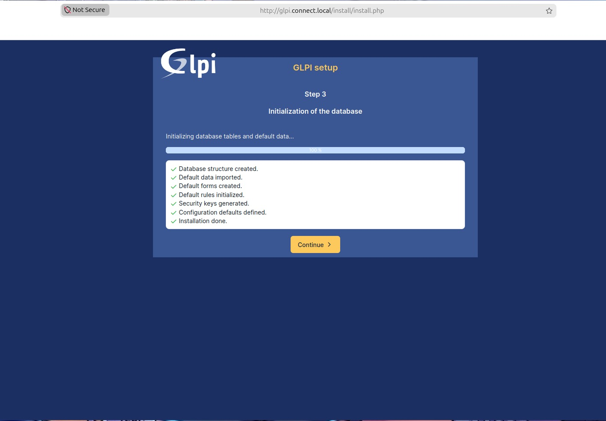](figuras/SETUP-08.jpeg) | Inicialização de todo o sistema |
| [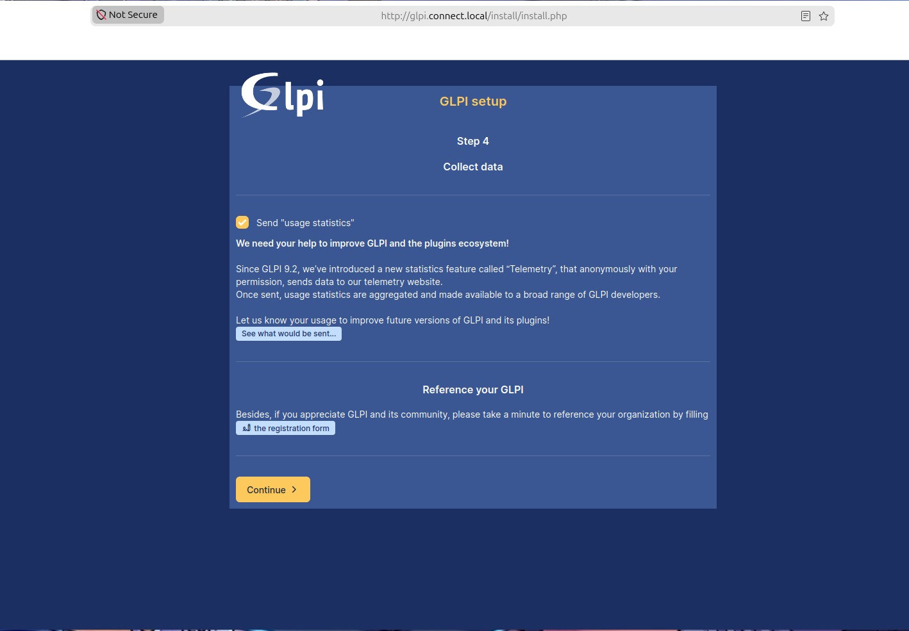](figuras/SETUP-09.jpeg) | Dados coletados |
| [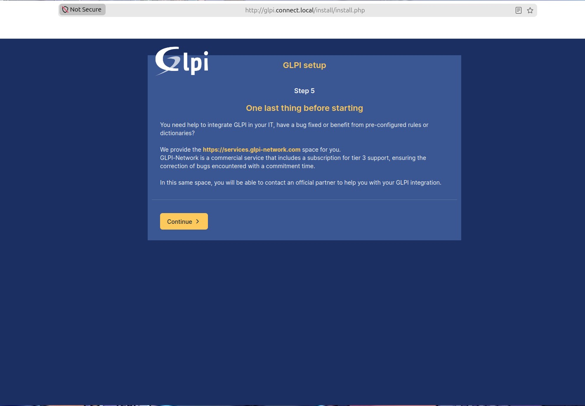](figuras/SETUP-10.jpeg) | Mensagem sobre GLPI-Network |
| [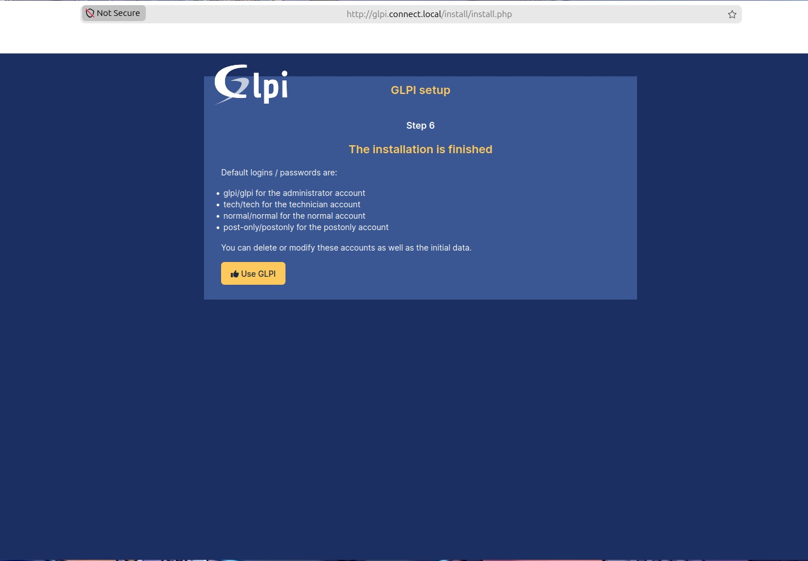](figuras/SETUP-11.jpeg) | A instalação está finalizada com sucesso |
| [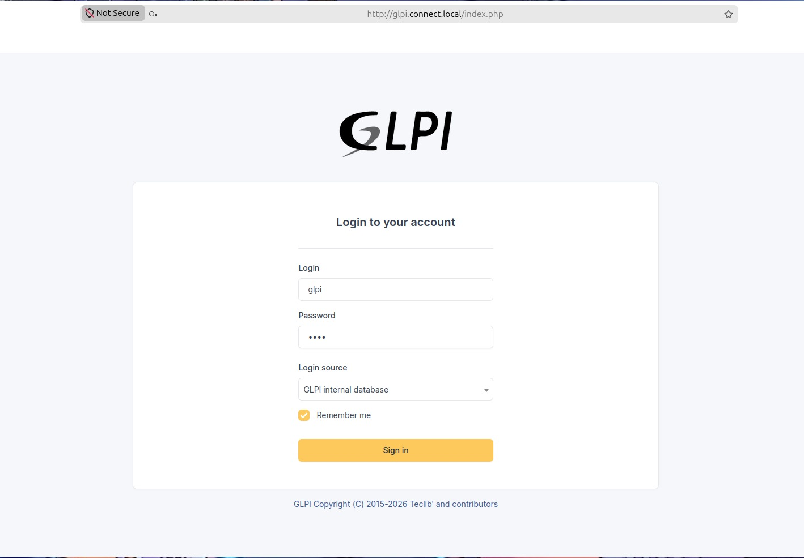](figuras/SETUP-12.jpeg) | Tela de login |

### Fim do Processo de Instalação do Sistema GLPI ###
