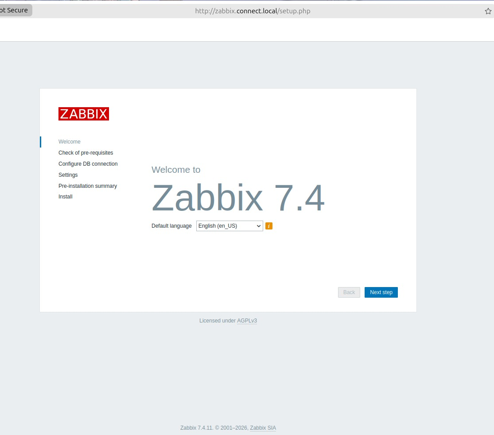
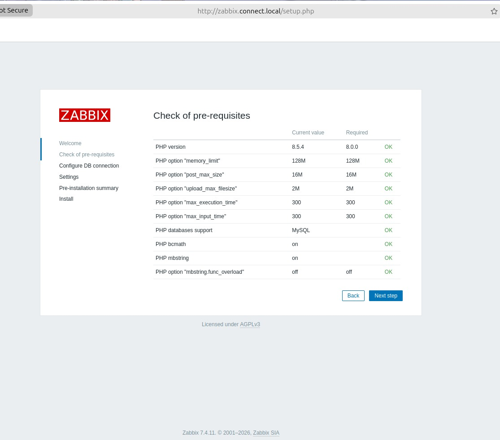
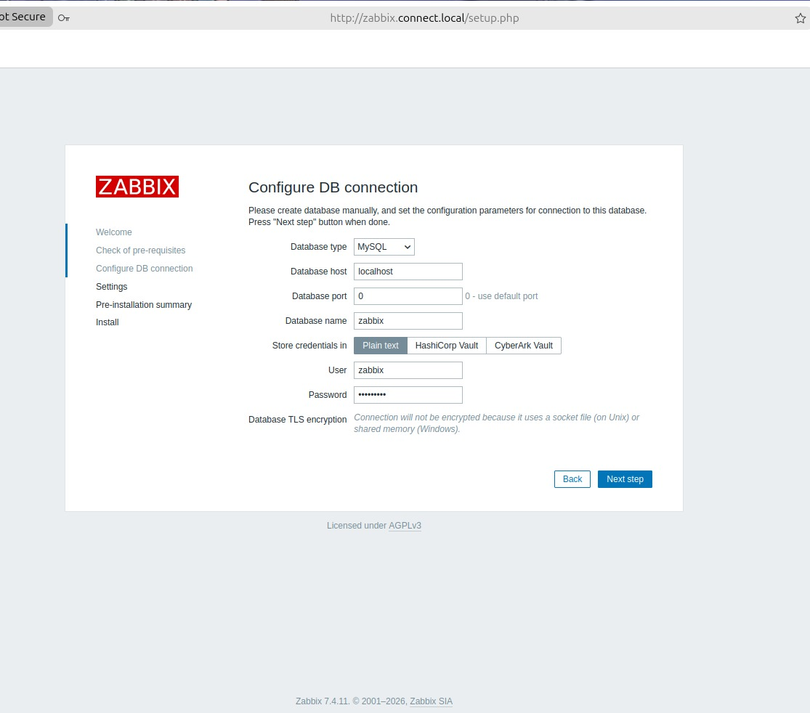
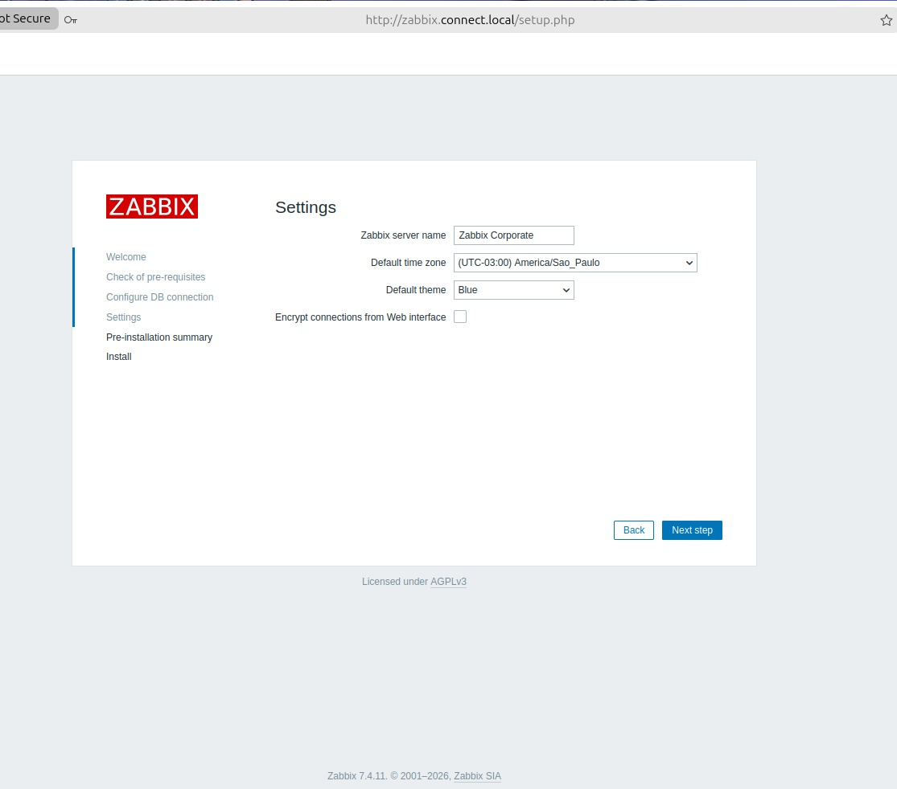
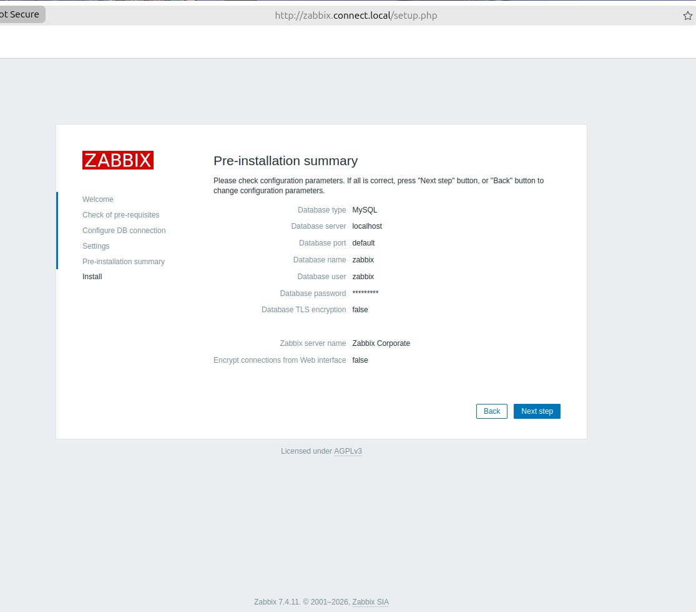
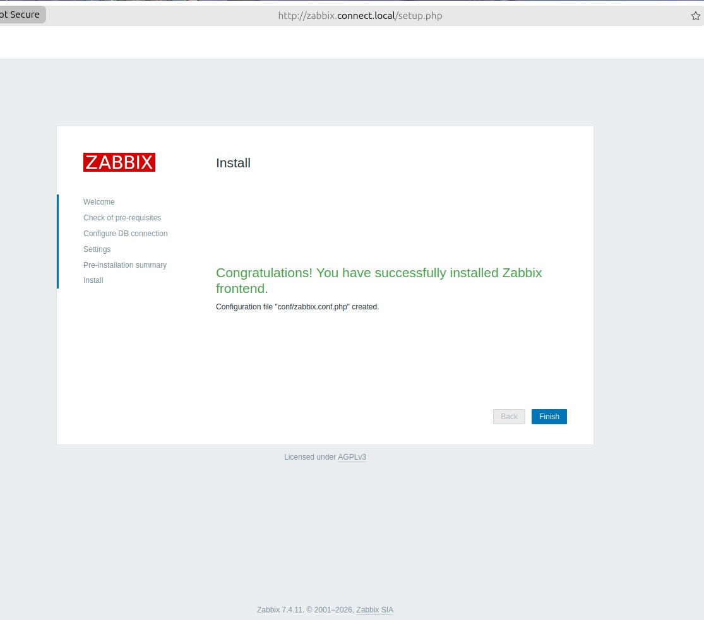
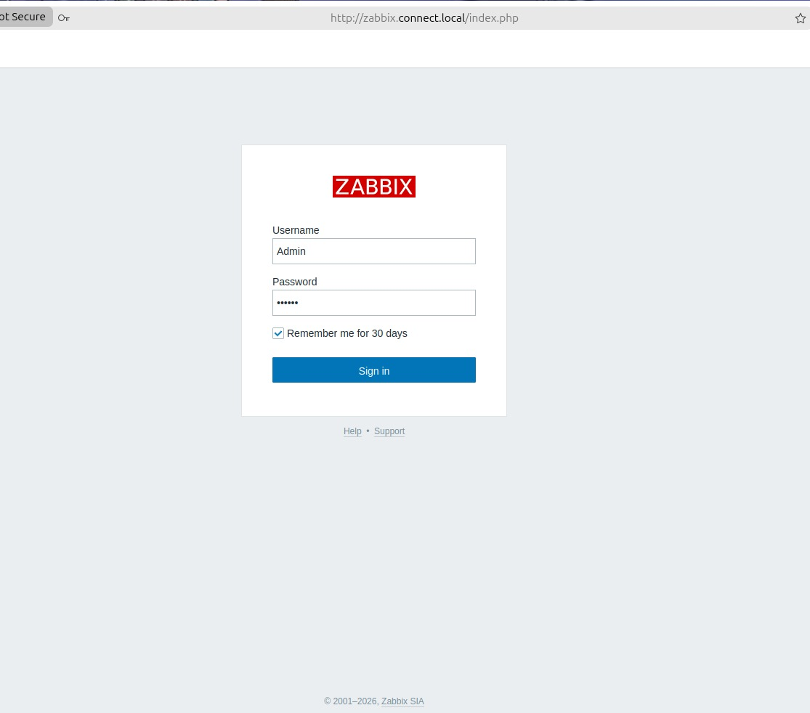
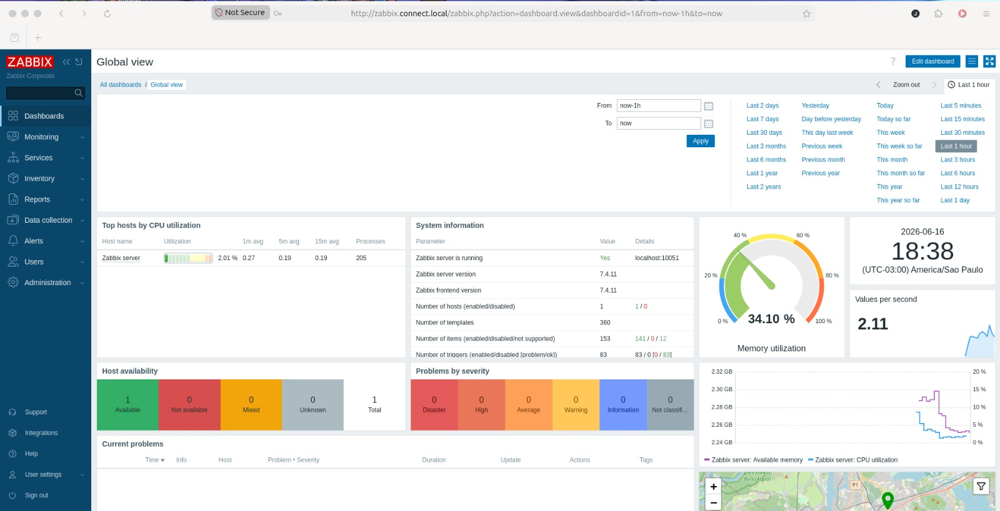

### Atualizar o sistema operacional Ubuntu 26.04
```bash
sudo apt update && sudo apt install -y
```
### Instalar o banco MySQL
```bash
sudo apt install mysql-server -y
```
### Baixar o repositório do Zabbix (  )
```bash
sudo wget https://repo.zabbix.com/zabbix/7.4/release/ubuntu/pool/main/z/zabbix-release/zabbix-release_latest_7.4+ubuntu26.04_all.deb
```

### Extrair o arquivo 
```bash
sudo dpkg -i zabbix-release_latest_7.4+ubuntu26.04_all.deb
```

### Atualizar o repositório e instalar os pacotes
```bash
sudo apt update -y
```

### Instalar os pacotes do Zabbix
```bash
sudo apt install zabbix-server-mysql zabbix-frontend-php zabbix-nginx-conf zabbix-sql-scripts zabbix-agent2 -y
```
### Instalar os plugins do agent 2
```bash
sudo apt install zabbix-agent2-plugin-mongodb zabbix-agent2-plugin-mssql zabbix-agent2-plugin-postgresql -y
```

### Criar o banco de dados e o usuário glpi
```bash
sudo mysql -u root -e "create database zabbix character set utf8mb4 collate utf8mb4_bin;;"
sudo mysql -u root -e "create user zabbix@localhost identified by '123@Mudar';"
sudo mysql -u root -e "grant all privileges on zabbix.* to zabbix@localhost;"
sudo mysql -u root -e "set global log_bin_trust_function_creators = 1;"
sudo mysql -u root -e "flush privileges;"
```

### Importar o banco de dados do Zabbix
```bash
sudo zcat /usr/share/zabbix/sql-scripts/mysql/server.sql.gz | mysql --default-character-set=utf8mb4 -uzabbix -p zabbix 
```

### Editar o arquivo zabbix_server.conf e colocar a senha do usuário zabbix
```bash
sudo vim  /etc/zabbix/zabbix_server.conf
```

```bash
### Option: DBPassword
#       Database password.
#       Comment this line if no password is used.
#
# Mandatory: no
# Default:
DBPassword=123@Mudar
```

### Configurando o arquivo nginx.conf
```bash
sudo vim /etc/zabbix/nginx.conf
```

```bash
server {
        listen          80;
        server_name     zabbix.connect.local;
```

### Iniciar todo o ambiente Zabbix
```bash
sudo systemctl restart zabbix-server zabbix-agent2 nginx php8.5-fpm
```
```bash
sudo systemctl enable zabbix-server zabbix-agent2 nginx php8.5-fpm
```

### Agora é acessar via browser o GLPI e iniciar o banco de dados .
```bash
http://zabbix.connect.local
```


## Figuras do Setup

| Imagem | Descrição |
|--------|-----------|
| [](figuras/SETUP-01.jpeg) | Configuração inicial |
| [](figuras/SETUP-02.jpeg) | Check list do sistema |
| [](figuras/SETUP-03.jpeg) | Conexão com o banco de dados |
| [](figuras/SETUP-04.jpeg) | Configuração de Time zone e nome |
| [](figuras/SETUP-05.jpeg) | Resumo das configurações |
| [](figuras/SETUP-06.jpeg) | Parabéns, sistema instalado |
| [](figuras/SETUP-07.jpeg) | Tela de login |
| [](figuras/SETUP-08.jpeg) | Dashboard principal |


### Fim do Processo de Instalação do Sistema Zabbix ###
